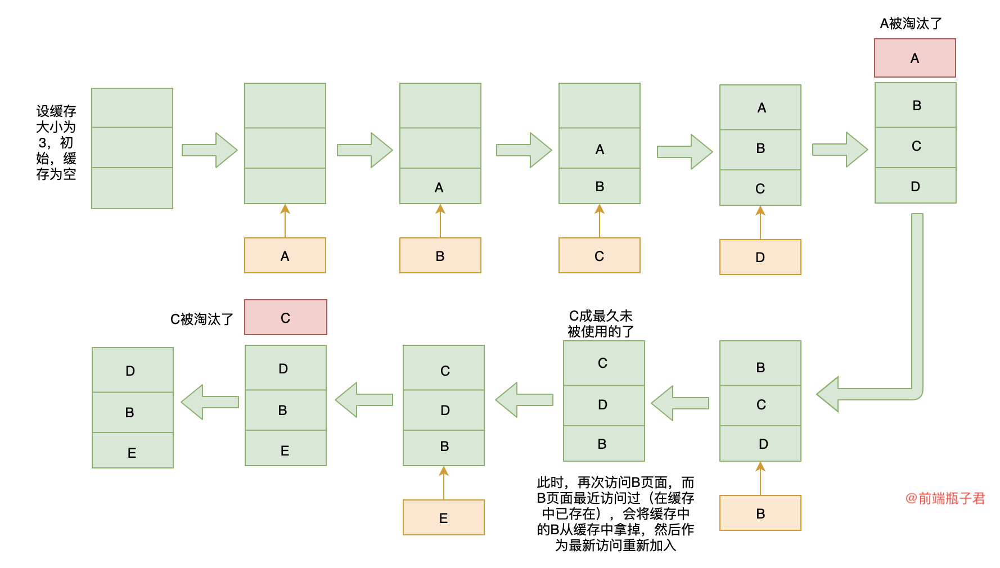

# 缓存淘汰策略(LRU)算法

## LRU 缓存淘汰策略

> LRU 全称是（`Least Recently Used`，即最近最少使用）缓存淘汰策略，LRU算法的设计原则是：如果一个数据在最近一段时间没有被访问到，那么在将来它被访问的可能性也很小。是缓存中一种常见的机制。

> [!note]
> **如果数据最近被访问过，那么将来被访问的几率也更高，优先淘汰最近没有被访问到的数据。**




## Leetcode: LRU缓存机制

获取数据 get(key) - 如果关键字 (key) 存在于缓存中，则获取关键字的值（总是正数），否则返回 -1。

写入数据 put(key, value) - 如果关键字已经存在，则变更其数据值；如果关键字不存在，则插入该组「关键字/值」。当缓存容量达到上限时，它应该在写入新数据之前删除最久未使用的数据值，从而为新的数据值留出空间。


### 示例

```js
LRUCache cache = new LRUCache( 2 /* 缓存容量 */ );

cache.put(1, 1);
cache.put(2, 2);
cache.get(1);       // 返回  1
cache.put(3, 3);    // 该操作会使得关键字 2 作废
cache.get(2);       // 返回 -1 (未找到)
cache.put(4, 4);    // 该操作会使得关键字 1 作废
cache.get(1);       // 返回 -1 (未找到)
cache.get(3);       // 返回  3
cache.get(4);       // 返回  4
```

---
### 实现

```js
/**
 * @param {number} capacity
 */
var LRUCache = function(capacity) {
    this.cache = new Map()
    this.max = capacity
};

/** 
 * @param {number} key
 * @return {number}
 */
LRUCache.prototype.get = function(key) {
    if (this.cache.has(key)) {
        let value = this.cache.get(key)
        this.cache.delete(key)
        this.cache.set(key, value)
        return value
    }
    return -1;
};

/** 
 * @param {number} key 
 * @param {number} value
 * @return {void}
 */
LRUCache.prototype.put = function(key, value) {
    if (this.cache.has(key)) {
        // 存在
        this.cache.delete(key)
    } else if (this.cache.size >= this.max) {
        let leastUsed = this.cache.keys().next().value
        this.cache.delete(leastUsed)
    }
    this.cache.set(key, value)
};

/**
 * Your LRUCache object will be instantiated and called as such:
 * var obj = new LRUCache(capacity)
 * var param_1 = obj.get(key)
 * obj.put(key,value)
 */
```

---

### 从leetcode题分析LRU机制

首先利用 `Map` 既能保存键值对，并且能够记住键的原始插入顺序

将最大缓存数赋值给实例属性`max`


#### 写入数据
```js
/** 
 * @param {number} key 
 * @param {number} value
 * @return {void}
 */
LRUCache.prototype.put = function(key, value) {
    if (this.cache.has(key)) {
        // 存在
        this.cache.delete(key)
    } else if (this.cache.size >= this.max) {
        let leastUsed = this.cache.keys().next().value
        this.cache.delete(leastUsed)
    }
    this.cache.set(key, value)
};
```

判断如果在`cache`的`map`中，更新值：

**删除对应值，并在最后设置为相同值，保证设置值是最常用的值**

```js
// 缓存值最大长度为3,此时缓存模型为:
const cache = new LRUCache(3)
cache.put(1, 1) // {1 => 1}
cache.put(2, 2) // {1 => 1, 2 => 2}
cache.put(3, 3) // {1 => 1, 2 => 2, 3 => 3}


cache.put(2, 4) // 找到对应key,进行更新
/**
 * 此时缓存模型为: {1 => 1, 3 => 3, 2 => 4}
 * 找到对应key，并且删除，将更新值插入最后，保证最常用值
 */
```

**如果缓存map长度大于等于最大设置长度，则删除缓存中第一个值（队列机制，将最少使用的值放到最前面，超出长度时删除最少使用的值）。**

```js
// 缓存值最大长度为3,此时缓存模型为:
const cache = new LRUCache(3)
cache.put(1, 1) // {1 => 1}
cache.put(2, 2) // {1 => 1, 2 => 2}
cache.put(3, 3) // {1 => 1, 2 => 2, 3 => 3}


cache.put(4, 4) // 进行第四次写入数据时，超出了长度限制
/**
 * 当进行第四次写入数据时，超出了长度限制，则先将 最少使用 进行删除并插入新写入数据
 * 删除头部数据，最少使用的值
 * 此时缓存模型为: {2 => 2, 3 => 3, 4 => 4} 
 */
```

---
#### 获取数据

```js
/** 
 * @param {number} key
 * @return {number}
 */
LRUCache.prototype.get = function(key) {
    if (this.cache.has(key)) {
        let value = this.cache.get(key)
        this.cache.delete(key)
        this.cache.set(key, value)
        return value
    }
    return -1;
};
```

**获取数据时，判断是否存在，如果不存在则返回`-1`，如果存在时删除对应值，并将值插入最后**

```js
// 缓存值最大长度为3,此时缓存模型为:
const cache = new LRUCache(3)
cache.put(1, 1) // {1 => 1}
cache.put(2, 2) // {1 => 1, 2 => 2}
cache.put(3, 3) // {1 => 1, 2 => 2, 3 => 3}

cache.get(1) // 此时缓存模型为: {2 => 2, 3 => 3, 1 => 1}
cache.get(4) // 不存在则返回 -1
```